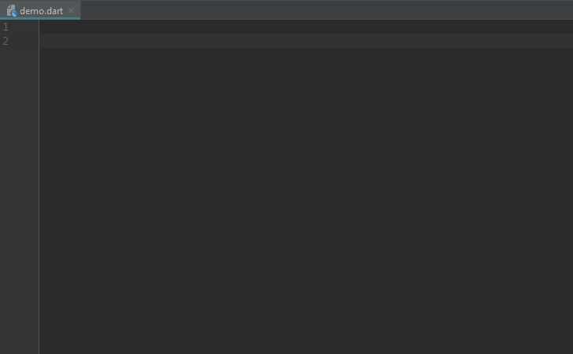

# Flutter built-value/BLoC Live Templates for Android Studio

Inspired by(and may be an addition to) https://github.com/benznest/flutter-snippet

Thanks to https://www.youtube.com/watch?v=BJY8nuYUM7M&list=PLB6lc7nQ1n4jtXh6TgCEIO4kCfIT0-NZl tutorial series for initial VSCode snippets idea.

## Installation
Download [flutter-snippet.jar](https://github.com/kkaun/flutter_AS_live_templates/raw/master/flutter-built-live-templates.jar)

Android Studio > File > Import Settings 

  

## Flutter Snippets

| Trigger                             | Content |
| -------:                            | ------- |
| `blt`                               | Built Value Class |
| `blth`                              | Built Value Imports and File Header |
| `blts`                              | Serializable Built Value Class |
| `bloc`                              | BLoC template class |
| `blt event`                         | Built Event template class |
| `blt state`                         | Built State template class |
| `serializers`                       | Serializers for Built Value util class |
